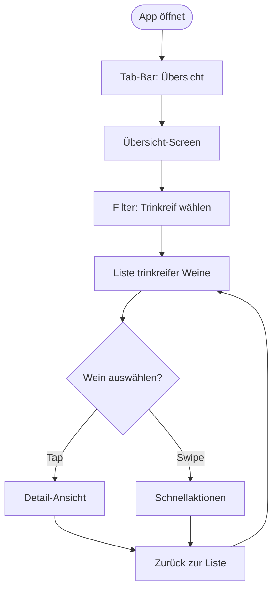
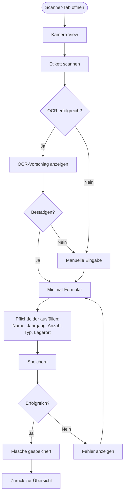
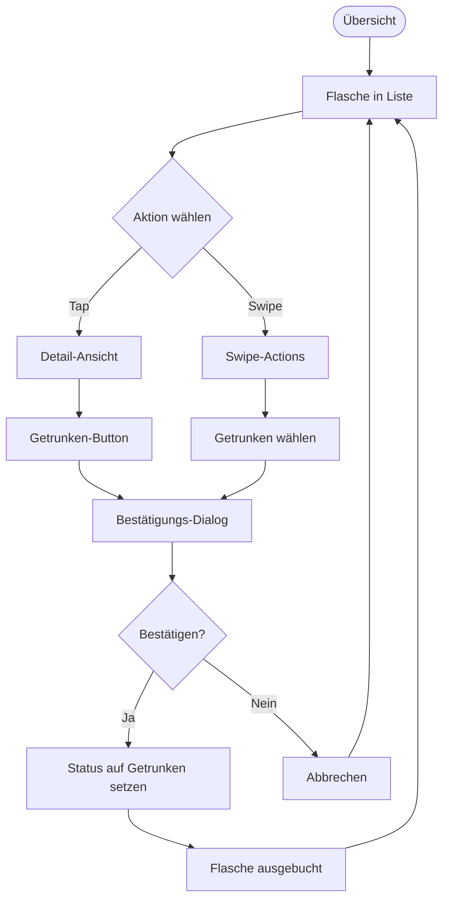
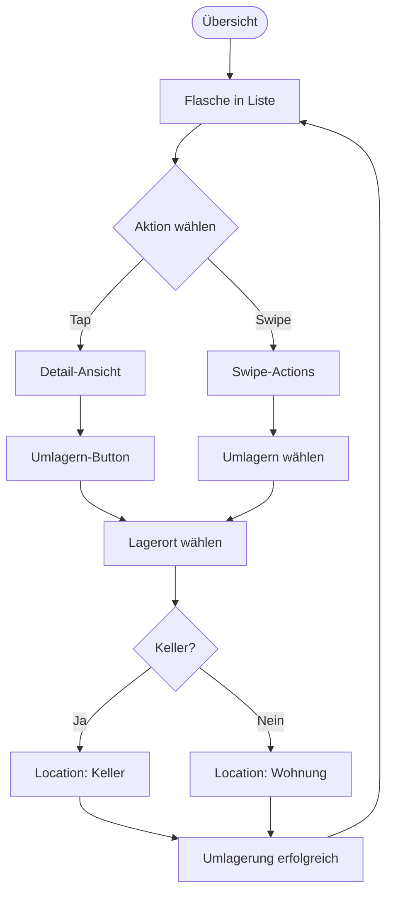
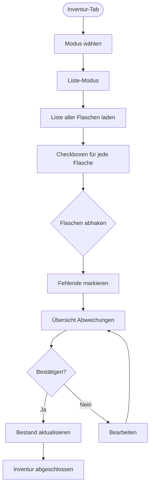
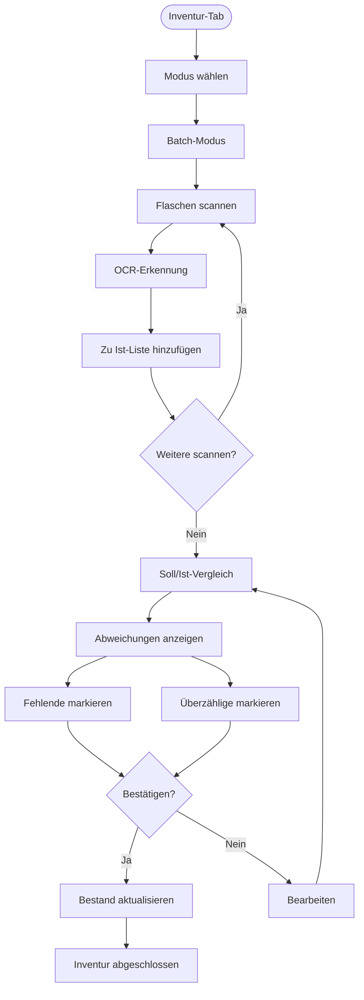
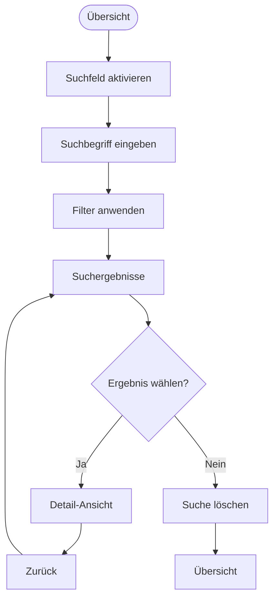
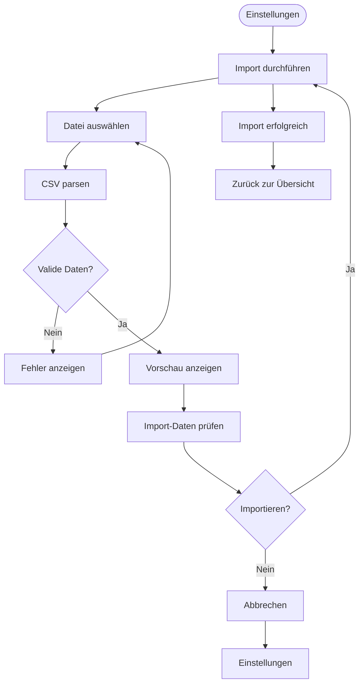

# User Flows für VinLogistics

Diese Dokumentation beschreibt die detaillierten User Flows für alle primären Aktionen in der App.

## Flow 1: Trinkreife prüfen

### Ziel
Schnell sehen, welche Weine jetzt trinkreif sind.

### Flow-Diagramm

### Schritte

1. **App öffnen** → Tab-Bar zeigt "Übersicht" als aktiven Tab
2. **Filter wählen** → Segmented Control: "Trinkreif" auswählen
3. **Liste anzeigen** → Weine mit `drinkabilityFrom ≤ aktuelles Jahr` werden angezeigt
4. **Sortierung**: Nach mittlerer Trinkreife (aufsteigend)
5. **Visuelle Hervorhebung**: Trinkreife Weine in Orange/Rot
6. **Interaktion**:
   - Tap auf Wein → Detail-Ansicht
   - Swipe-Left → Schnellaktionen (Umlagern, Getrunken)

### Edge Cases

- **Keine trinkreifen Weine**: Zeige leere Liste mit Hinweis "Keine trinkreifen Weine"
- **Viele trinkreife Weine**: Lazy Loading, Smooth Scrolling
- **Offline**: Funktioniert vollständig offline

## Flow 2: Flasche hinzufügen (Scanner)

### Ziel
Neue Flasche schnell erfassen (Speed-to-Action: < 5 Sekunden).

### Flow-Diagramm

### Schritte

1. **Scanner-Tab öffnen** → Vollbild-Kamera wird angezeigt
2. **Etikett scannen** → OCR erkennt Weingut und Jahrgang
3. **OCR-Ergebnis**:
   - **Erfolgreich**: Vorschlag wird angezeigt, Nutzer kann bestätigen oder korrigieren
   - **Fehlgeschlagen**: Direkter Übergang zu manueller Eingabe
4. **Minimal-Formular** (nur Pflichtfelder):
   - Name (Weingut) - Textfeld
   - Jahrgang - Zahleneingabe
   - Anzahl - Stepper (Standard: 1)
   - Flaschen-Typ - Picker (Standard: Standard)
   - Lagerort - Segmented Control (Standard: Keller)
5. **Speichern** → Ein-Klick, Details später bearbeitbar
6. **Erfolg** → Zurück zur Übersicht, neue Flasche wird angezeigt

### Entscheidungspunkte

- **OCR-Qualität**: Wenn OCR unsicher ist, manuelle Eingabe vorschlagen
- **Bereits vorhanden**: Wenn identische Flasche existiert, Anzahl erhöhen oder neuen Eintrag?
- **Offline**: Funktioniert vollständig offline, Sync später

### Edge Cases

- **Schlechtes Licht**: OCR-Fallback zu manueller Eingabe
- **Unleserliches Etikett**: Direkte manuelle Eingabe
- **Doppelte Erfassung**: Warnung wenn identische Flasche bereits existiert
- **Netzwerkfehler**: Lokal speichern, Sync später

## Flow 3: Flasche ausbuchen

### Ziel
Flasche als getrunken markieren (Speed-to-Action: < 2 Sekunden).

### Flow-Diagramm

### Schritte

1. **Flasche finden** → In Übersicht navigieren
2. **Aktion auslösen**:
   - **Option A**: Tap → Detail-Ansicht → "Getrunken"-Button
   - **Option B**: Swipe-Left → "Getrunken" wählen
3. **Bestätigung**: Dialog "Flasche als getrunken markieren?"
4. **Bestätigen** → Status wird auf "Getrunken" gesetzt
5. **Erfolg** → Flasche verschwindet aus aktiven Listen, bleibt in Historie

### Entscheidungspunkte

- **Anzahl > 1**: Soll eine Flasche oder alle ausgebucht werden?
- **Bestätigung**: Immer Bestätigungs-Dialog um versehentliches Ausbuchen zu vermeiden

### Edge Cases

- **Anzahl reduzieren**: Wenn mehrere Flaschen, Anzahl reduzieren statt ausbuchen?
- **Rückgängig**: Möglichkeit zum Rückgängig innerhalb von 5 Sekunden?

## Flow 4: Flasche umlagern

### Ziel
Flasche zwischen Keller und Wohnung verschieben (Speed-to-Action: < 2 Sekunden).

### Flow-Diagramm

### Schritte

1. **Flasche finden** → In Übersicht navigieren
2. **Aktion auslösen**:
   - **Option A**: Tap → Detail-Ansicht → "Umlagern"-Button
   - **Option B**: Swipe-Left → "Umlagern" wählen
3. **Lagerort wählen**: Segmented Control
   - Keller ("Ja")
   - Wohnung ("Oben")
4. **Bestätigen** → Location wird aktualisiert
5. **Erfolg** → Flasche erscheint in neuem Lagerort-Filter

### Entscheidungspunkte

- **Sofortige Aktualisierung**: Keine Bestätigung nötig, direkte Änderung
- **Anzahl > 1**: Alle Flaschen umlagern oder nur eine?

### Edge Cases

- **Gleicher Lagerort**: Wenn bereits am gewählten Ort, keine Aktion
- **Offline**: Funktioniert vollständig offline

## Flow 5: Inventur durchführen (Liste-Modus)

### Ziel
Soll/Ist-Abgleich der Sammlung durchführen.

### Flow-Diagramm

### Schritte

1. **Inventur-Tab öffnen** → Modus-Auswahl
2. **Liste-Modus wählen** → Soll-Liste wird geladen
3. **Durchgehen** → Jede Flasche hat Checkbox
4. **Abhaken** → Vorhandene Flaschen markieren
5. **Fehlende markieren** → Flaschen die nicht gefunden wurden
6. **Übersicht** → Abweichungen werden angezeigt
7. **Bestätigen** → Bestand wird aktualisiert

### Entscheidungspunkte

- **Fehlende Flaschen**: Als "Ausgetrunken" markieren oder löschen?
- **Überzählige Flaschen**: Neue Flaschen hinzufügen?

### Edge Cases

- **Große Sammlung**: Lazy Loading, Performance-Optimierung
- **Unterbrechung**: Inventur kann gespeichert und später fortgesetzt werden

## Flow 6: Inventur durchführen (Batch-Modus)

### Ziel
Mehrere Flaschen scannen und mit Soll-Liste abgleichen.

### Flow-Diagramm

### Schritte

1. **Inventur-Tab öffnen** → Modus-Auswahl
2. **Batch-Modus wählen** → Scanner wird aktiviert
3. **Flaschen scannen** → Mehrere Flaschen nacheinander scannen
4. **OCR-Erkennung** → Jede Flasche wird erkannt und zur Ist-Liste hinzugefügt
5. **Vergleich** → Soll/Ist-Abgleich wird durchgeführt
6. **Abweichungen**:
   - Fehlende Flaschen (in Soll, nicht in Ist)
   - Überzählige Flaschen (in Ist, nicht in Soll)
7. **Bestätigen** → Bestand wird aktualisiert

### Entscheidungspunkte

- **OCR-Fehler**: Manuelle Korrektur möglich
- **Doppelte Scans**: Erkennung und Warnung

### Edge Cases

- **Viele Flaschen**: Performance bei großen Mengen
- **OCR-Qualität**: Fallback zu manueller Eingabe

## Flow 7: Sammlung durchsuchen

### Ziel
Bestimmte Flasche in der Sammlung finden.

### Flow-Diagramm

### Schritte

1. **Suchfeld aktivieren** → In Übersicht-Tab
2. **Suchbegriff eingeben** → Name, Jahrgang, Region, etc.
3. **Filter anwenden** → Ergebnisse werden live gefiltert
4. **Ergebnisse anzeigen** → Gefilterte Liste
5. **Flasche auswählen** → Detail-Ansicht

### Suchkriterien

- Name (Weingut)
- Jahrgang
- Land/Region
- Lagerort
- Trinkreife
- Flaschen-Typ

### Edge Cases

- **Keine Ergebnisse**: Hinweis "Keine Ergebnisse gefunden"
- **Viele Ergebnisse**: Lazy Loading
- **Offline**: Funktioniert vollständig offline

## Flow 8: CSV-Import (Migration)

### Ziel
Bestehende CSV-Datei importieren.

### Flow-Diagramm

### Schritte

1. **Einstellungen öffnen** → CSV-Import wählen
2. **Datei auswählen** → File Picker
3. **CSV parsen** → Daten werden eingelesen
4. **Validierung** → Prüfung auf valide Daten
5. **Vorschau** → Import-Daten werden angezeigt
6. **Prüfen** → Nutzer kann Daten prüfen
7. **Importieren** → Daten werden in SwiftData importiert
8. **Erfolg** → Zurück zur Übersicht, Daten sind verfügbar

### Entscheidungspunkte

- **Duplikate**: Wie mit bereits vorhandenen Flaschen umgehen?
- **Fehlerhafte Daten**: Welche Felder sind optional, welche Pflicht?

### Edge Cases

- **Falsches Format**: CSV-Format-Validierung
- **Große Dateien**: Performance bei vielen Einträgen
- **Teilweise Fehler**: Welche Daten werden importiert, welche nicht?

## Allgemeine Entscheidungspunkte

### Offline-Verhalten

- Alle Flows funktionieren offline
- Daten werden lokal gespeichert
- Sync erfolgt im Hintergrund wenn Online

### Fehlerbehandlung

- Klare Fehlermeldungen
- Möglichkeit zur Wiederholung
- Keine Datenverluste

### Performance

- Lazy Loading für große Listen
- Smooth Scrolling
- Schnelle Reaktionszeiten (< 1 Sekunde)
